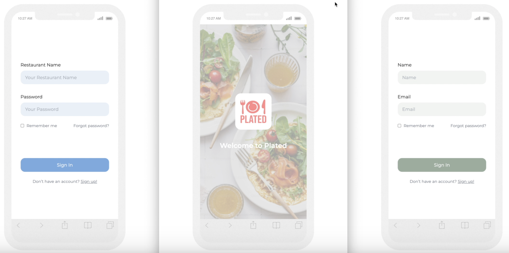

# Food Ordering Online System (Work in Progress)

## Overview

This is the **frontend implementation** of **Plated**, a food ordering platform that connects users with restaurants for browsing and ordering food with live updates. The app is built with **Next.js** and features a user-friendly interface, real-time notifications, and dynamic cart updates.

[Figma Design](https://www.figma.com/proto/eGNq2Xx8ZPKMoEEAZwV9rZ/Plated---Bojana?node-id=1534-1481&p=f&t=F5RrhT0sZiHNQwnr-9&scaling=scale-down&content-scaling=fixed&page-id=0%3A1&starting-point-node-id=1534%3A1481&show-proto-sidebar=1)

[Watch the Video Presentation:](https://www.loom.com/share/67548aa8584246e585bc26610f71a5d8)

---

## Features

### User
- **Explore Restaurants**: Browse and view details of restaurants, including menus.
- **Order Management**: Add items to the cart, review orders, and place them directly.
- **Profile Management**: Users can view and update personal information.
- **Real-Time Notifications**: Users receive updates on order statuses directly via live notifications.

### Restaurant
- **Dashboard**: Manage menus, view and process orders and update restaurant details.
- **Real-Time Notifications**: Receive notifications from the user for orders and sends updates for order status to the courier.

### Courier
- **Real-Time Notifications**: Receive notifications from the restaurant for order pick up and sends updates for order status to the user.

---

## Technologies Used

- **Frontend Framework**: Next.js (React)
- **Styling**: TailwindCSS
- **State Management**: Context API for managing user and cart states.
- **API Integration**: Axios for making RESTful API calls.
- **Real-Time Communication**: Socket.IO for WebSocket integration.
- **Image Hosting**: AWS S3 Bucket.

---

## Future Improvements

- Extend WebSocket functionality for real-time live chat between users and couriers.
- Add unit and integration testing for key components and pages.
- Optimize UI/UX for a more intuitive user experience.
